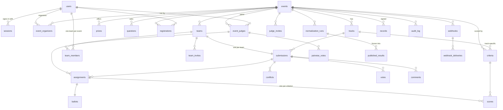

# Data model

PostgreSQL 16. The schema lives in `src/api/migrations/`, applied in order
at boot and tracked in `schema_migrations`:

- `001_schema.sql`: tables, constraints, indexes.
- `002_security.sql`: the application role, Row-Level Security, triggers and
  the audit hash chain.
- `003_harden_secrets.sql`: hides stored secrets from the request role.

Conventions:

- **Ids** are `text` with a readable prefix: `usr_`, `evt_`, `trk_`, `team_`,
  `sub_`, `crt_`, `asg_`, `run_`, `vote_`, `rec_`, and so on.
- **Timestamps** are `timestamptz`, stored in UTC and compared on the server
  clock.
- **Columns** are `snake_case`; the API maps them to `camelCase` DTOs
  (`src/core/src/types.ts`).
- **Integrity** rules belong in the database whenever they can be stated
  there. The API also checks them first so it can return friendly errors;
  the database is the backstop.

## Entity–relationship overview

## Tables by domain

### Identity and access

| Table | Purpose and key rules |
|---|---|
| `users` | `role ∈ {visitor, participant, judge, organizer, admin}`. Email is unique case-insensitively (`lower(email)` index). `password_hash` is `scrypt$N$r$p$salt$hash`. Setting `disabled_at` blocks every session immediately. |
| `sessions` | Web sessions, API tokens and checker tokens (`kind`). Only the **SHA-256 of the token** is stored (`token_hash UNIQUE`). Each has an expiry; `last_used_at` is sampled every 5 minutes. |
| `settings` | `app_secret` (HMAC key for IPs, emails and voter cookies) and `signing_key` (Ed25519 PKCS#8 PEM). **Not readable by the request role** (migration 003). |

### Events and structure

| Table | Purpose and key rules |
|---|---|
| `events` | Lifecycle is `draft → published → archived`. The time windows carry `CHECK` constraints: the deadline is after the start, voting open/close are both set or both null, and close is after open. Also holds team-size bounds, voting mode, style and budget, `reviews_per_submission`, and the normalization target (`norm_target_mean`, `norm_target_sd`, `norm_min_sample`). Setting `results_published_at` publishes results. |
| `event_organizers` | Many organizers per event. This is how organizer tenancy is scoped. |
| `tracks`, `prizes`, `questions` | Children of an event, ordered by `position`. `UNIQUE (id, event_id)` on tracks lets other tables use **composite foreign keys**, so a submission or criterion can never point at another event's track. |
| `criteria` | The weighted rubric. `weight > 0`, `max_score` is 1–100. `track_id NULL` means the criterion applies to every track. |

### Teams and submissions

| Table | Purpose and key rules |
|---|---|
| `registrations` | `(event_id, user_id)`: the participant has joined the event. |
| `teams` | Unique name per event. `deadline_extension_until` and `extension_reason` hold per-team extensions, which are audited. |
| `team_members` | **`UNIQUE (event_id, user_id)` enforces one team per person per event in the database.** The composite FK `(team_id, event_id)` keeps the event column consistent. `role ∈ {captain, member}`. |
| `team_invites` | `token_hash UNIQUE`; the raw token is never stored. `expires_at`, `used_at` and `used_by`, and `revoked_at` make the link single-use, expiring and revocable. |
| `submissions` | **One per team** (`team_id UNIQUE`). `status ∈ {draft, submitted}`, with `CHECK ((status = 'submitted') = (submitted_at IS NOT NULL))`. `eligibility ∈ {pending, eligible, ineligible}` is organizer-owned. `answers` is jsonb keyed by question id. `search` is a **generated weighted `tsvector`** over title (A), tagline and tags (B), and description (C), with a GIN index. `tech_tags text[]` also has a GIN index. |
| `uploads` | Metadata for stored images: owner, random filename, detected type, size and SHA-256. |

### Judging

| Table | Purpose and key rules |
|---|---|
| `event_judges` | The panel. `track_ids NULL` means all tracks; otherwise the judge is scoped to those tracks. |
| `judge_invites` | Like team invites, and they can carry a track scope. |
| `conflicts` | `(judge_id, submission_id)` pairs the router must avoid. They come from organizer declarations and judge recusals. |
| `assignments` | `UNIQUE (judge_id, submission_id)`. The FK `(event_id, judge_id) → event_judges` means **only panel members can hold assignments**. `status ∈ {pending, in_progress, submitted}`; the request role may update only `status` and `updated_at`. |
| `ballots` | One per assignment. `raw_total` is cached for display only, because normalization always recomputes it. `submitted_at` marks the ballot as final. |
| `scores` | One row per `(assignment, criterion)`, with `value ≥ 0`. Upper bounds are enforced by a trigger against `criteria.max_score`. |
| `pairwise_votes` | `winner_id <> loser_id`. Only panel members can vote, enforced by FK. The API refuses to record the same unordered pair twice for one judge. |
| `normalization_runs` | An immutable snapshot of every run: `config` plus the full `outcome` (per-judge stats, every normalized entry, results, invariants and Spearman). Any published ranking can be re-derived from it. |
| `published_results` | The public projection of the run that was published: rank, normalized score, raw mean, judge count and pairwise rank. It holds **no per-judge data**. |

### Community

| Table | Purpose and key rules |
|---|---|
| `votes` | **`UNIQUE (event_id, voter_key, submission_id)`**: one row per voter per project, so re-voting updates the row. `voter_key` is `u:<user>`, `e:<email-hmac>` or `d:<device-hmac>`. `ip_hash` and `ua_hash` are keyed or plain hashes; the raw values are never stored. `status ∈ {counted, flagged, rejected}` with `flag_reason`. |
| `vote_email_codes` | One-time codes stored as an HMAC, with an attempt counter and an expiry. |
| `outbox` | The local mail spool. The platform never calls an external email API, so it works offline; admins can read the spool. |
| `comments` | Moderation via `hidden_at` and `hidden_by`. |
| `notifications` | A per-user in-app feed. `kind ∈ {announcement, assignment, invite, team_request}` with an optional `event_id`, a `link` and `read_at`. Reads always filter `user_id = <caller>`; rows are written by the announcement, assignment, invitation and team-join-request code paths in the same transaction as the change. |

### Integrations and trust

| Table | Purpose and key rules |
|---|---|
| `webhooks` | Per event. Holds the target URL, the subscribed `events text[]` and the signing secret, which is shown once. |
| `webhook_deliveries` | Outbox pattern: rows are inserted **in the same transaction** as the domain change, so a rolled-back change emits nothing. Retries use `attempts`, `next_attempt_at` (exponential backoff and a lease) and `status ∈ {pending, delivered, failed}`. |
| `records` | Ed25519-signed JSON: `kind ∈ {judge_participation, participant, winner}`, with `UNIQUE (event_id, user_id, kind)`. `revoked_at` supports revocation. |
| `audit_log` | Append-only, hash-chained. `seq`, `prev_hash`, `hash` and `created_at` are assigned by trigger under an advisory lock, so the chain is gap-free and totally ordered. Each row records the actor, action, entity, a human-readable summary and structured `data`. |

## What the database enforces by itself

| Rule | Mechanism |
|---|---|
| A judge sees and writes only their own assignments, ballots, scores and pairwise votes | `FORCE ROW LEVEL SECURITY` with policies on `judge_id = app_user_id()`; see the matrix below |
| Organizers see only the events they run | `app_is_event_organizer(event_id)` in the staff policies |
| Ballots and scores cannot be re-pointed at another judge, event or project | Triggers `ballots_00_ownership` and `scores_00_ownership` derive those columns from the assignment |
| Scores stay within the criterion maximum | Trigger `scores_10_bounds` |
| No content edits after the deadline (or the team's extension) | Trigger `submissions_deadline`. Eligibility changes stay allowed. |
| One team per person per event; one submission per team | `UNIQUE` constraints |
| Children never cross events | Composite FKs `(x_id, event_id)` |
| Only panel judges hold assignments or pairwise votes | FK to `event_judges (event_id, user_id)` |
| One vote row per voter per project | `UNIQUE (event_id, voter_key, submission_id)` |
| The audit log cannot be edited, deleted or truncated | The app role lacks the grants, **and** an owner-level trigger refuses; `audit_log_verify()` recomputes the chain |
| The request role cannot read secrets | `REVOKE ALL ON settings FROM dogfood_app` |

### Row-Level Security matrix

The API runs every request in a transaction that does
`SET LOCAL ROLE dogfood_app` (a non-owner role without `BYPASSRLS`) and sets
`app.user_id` and `app.role`. Trusted jobs such as seeding, snapshots and the
webhook worker use `app.role = 'system'`.

| Table | Judge (own rows) | Event organizer / admin | system | Anyone else |
|---|---|---|---|---|
| `assignments` | SELECT; UPDATE `status` only | ALL | via staff policy | — |
| `ballots` | ALL (WITH CHECK: own assignment) | SELECT | ALL | — |
| `scores` | ALL (WITH CHECK: own assignment) | SELECT | ALL | — |
| `pairwise_votes` | SELECT, INSERT | ALL | via staff policy | — |
| `normalization_runs` | — | ALL | ALL | — |

`tests/integration/isolation.test.ts` executes raw SQL as `dogfood_app` for
several identities and asserts these outcomes: foreign rows are invisible,
unfiltered `UPDATE`s touch zero rows, and inserts on someone else's
assignment fail.

## Indexes that matter

| Index | Serves |
|---|---|
| `assignments (judge_id, event_id)`, `ballots (judge_id, event_id)`, `scores (judge_id, event_id)` | The RLS predicate and judge queues |
| `submissions (event_id, status, track_id)` | Gallery listing and filters |
| `submissions USING gin (search)`, `USING gin (tech_tags)` | Full-text search and tag facets |
| `votes (event_id, ip_hash)` | The Sybil heuristic (distinct voters per IP) |
| `webhook_deliveries (status, next_attempt_at)` | The worker's due-queue scan |
| `audit_log (event_id, seq DESC)`, `(action)` | Per-event audit view and filters |
| `normalization_runs (event_id, created_at DESC)` | Latest run |

## Fixtures (`fixtures.json`, format `dogfood.fixtures.v1`)

The file is generated deterministically by `scripts/generate-fixtures.py` and
loaded into an empty database at boot (`SEED_ON_BOOT=true`), or on demand
with `node dist/cli.mjs seed` and `reset --yes`. Times are **relative to seed
time** (`"now-6h"`, `"now+2d"`), so a fresh stack always has one event in
each phase:

| Event | Phase at seed time | Used for |
|---|---|---|
| `evt_01` Sample Hack 2026 | Judging, open-link voting live | 6 judges with deliberately different leniency (strict A, lenient B), a civic-only judge with 4 ballots (Min-Max fallback), a declared conflict, pairwise comparisons, a 7-voter Sybil cluster, comments, one ineligible project |
| `evt_02` Autumn Build Week | Submissions open; email-gated quadratic voting later | Drafts, invites, deadline behaviour |
| `evt_03` Spring Hack 2026 | Archived; results published; records issued | Public leaderboard, signed certificates |
| `evt_04` Winter Jam 2027 | Draft owned by `organizer2` | Tenant isolation |

The file also defines 50 users (demo password `dogfood-demo-2026`). The
`checkerSessions` entries hold the stable per-role tokens listed in
`.dogfood.toml`. They are re-seeded on every boot while
`CHECKER_SESSIONS=true`; disable that in production.

## Export bundle (`dogfood.event.v1`)

`GET /api/events/:id/export.json` returns the event configuration together
with its tracks, prizes, questions and criteria, where criteria and prizes
reference tracks by `ref`. The same bundle also carries teams with members,
submissions, judges and assignments. `POST /api/events/import` accepts the
configuration subset and creates a **draft** clone. Track references are
re-linked to the new track ids. Both directions are exercised by
`platform.test.ts` and acceptance check T4.06.

## Optional AI artifacts (`006_ai.sql`)

| Table | Purpose | RLS |
|---|---|---|
| `project_classifications` | Cached project tags + primary category (`submission_id` PK) | staff ALL, system ALL |
| `judge_expertise` | Cached judge tags per event (`event_id, judge_id` PK) | staff ALL, judge self-read, system ALL |
| `project_summaries` | Cached public summary + tags (`submission_id` PK) | public SELECT, staff ALL, system ALL |
| `judge_feedback` | Private judge feedback draft (`assignment_id` PK) | judge own ALL, staff SELECT, system ALL |

AI is off by default; these tables stay empty and no AI route is called unless
`AI_ENABLED=true`. None of them feeds normalization or published results.
